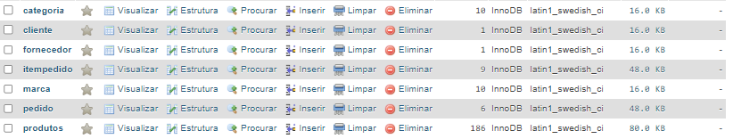
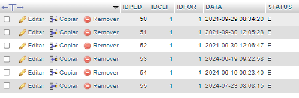
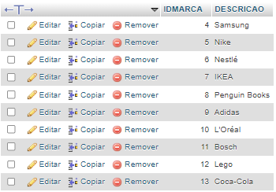

# Catálogo de Produtos📑

### Este projeto é um sistema básico de catálogo de produtos desenvolvido para facilitar o gerenciamento de informações de produtos, categorias e marcas em um ambiente web.

## Status do Projeto
- ### Terminado✅ ``` (No ar) ```

## **📄Objetivo**
- Esta aplicação visa criar um sistema online para gerenciar e organizar informações de produtos de forma eficiente

## Funcionalidades Principais🛠️

###  Cadastro de Categorias e Marcas📲: 
- Permite adicionar novas categorias e marcas para organizar os produtos.

### Cadastro de Produtos✏️:
-  Inclui informações detalhadas como nome, descrição, estoque e preço para cada produto.

### Visualização de Produtos💻:
- Permite visualizar todos os produtos cadastrados, filtrar por categoria e marca.

## Tecnologias Utilizadas
- Banco de Dados: MySQL
- Backend: PHP 8.2
- Frontend: HTML 5, CSS 3, jQuery 2.1.4
- Servidor: Apache (XAMPP, WampServer, etc.)

## Estrutura do Banco de Dados
### Tabelas

## Categoria

- IDCATEGORIA (int, PK): Identificador único da categoria.
- ESCRICAO (varchar): Descrição da categoria.
  
##  Marca

- IDMARCA (int, PK): Identificador único da marca.
- DESCRICAO (varchar): Descrição da marca.

## Produtos

- IDPRODUTO (int, PK): Identificador único do produto.
- NOME (varchar): Nome do produto.
- DESCRICAO (text): Descrição detalhada do produto.
- ESTOQUE (int): Quantidade disponível em estoque.
- PRECO (decimal): Preço unitário do produto.
- IDCATEGORIA (int, FK): Chave estrangeira referenciando a tabela categoria.
- IDMARCA (int, FK): Chave estrangeira referenciando a tabela marca.
#

# Demonstração do projeto

## Tela do banco



## Tabela de pedidos



## Tabela de marcas



## Tela Inicial


## Tela de cadastro de produto


## Tela de cadastro de categoria


## Tela de cadastro de marca


# **👨‍💻Faça o clone do projeto em sua máquina para testes**
``` bash
  git clone https://github.com/tatacarollinydev/compra-projeto
  cd compra-projeto
```

# Funções e Métodos do PHP
 
Este documento descreve algumas funções e métodos comuns utilizados em PHP para manipulação de banco de dados e controle de sessões.
 
## Funções e Métodos
 
### `include_once()`
 
Adiciona e executa um arquivo apenas uma vez durante o script.
 
```php
  include_once 'config.php';
```
 
### `mysqli_query()`
 
Executa uma consulta no banco de dados MySQL.
 
```php
  $query = "SELECT * FROM users";
  $result = mysqli_query($conn, $query);
```
 
### `while`
 
Repite um bloco de código enquanto a condição for verdadeira.
 
```php
  while ($row = mysqli_fetch_assoc($result)) {
    echo $row['username'];
  }
```
 
### `mysqli_fetch_assoc()`
 
Obtém uma linha de resultados como uma matriz associativa.
 
```php
  $row = mysqli_fetch_assoc($result);
  echo $row['username'];
```
 
### `echo`
 
Mostra uma ou mais strings na tela.
 
```php
  echo "Hello, World!";
```
 
### `mysqli_affected_rows()`
 
Mostra quantas linhas foram afetadas pela última consulta.
 
```php
  $query = "UPDATE users SET email='example@example.com' WHERE id=1";
  mysqli_query($conn, $query);
  echo mysqli_affected_rows($conn);
```
 
### `mysqli_close()`
 
Fecha a conexão com o banco de dados MySQL.
 
```php
  mysqli_close($conn);
```
 
### `mysqli_error()`
 
Mostra a mensagem de erro da última operação no banco de dados.
 
```php
  $query = "SELECT * FROM nonexistent_table";
  $result = mysqli_query($conn, $query);
  if (!$result) {
      echo mysqli_error($conn);
}
 
```
 
### `__construct()`
 
Função especial que é chamada quando um objeto é criado.
 
```php
  class User {
    public function __construct() {
        echo "User object created.";
    }
  }
  $newUser = new User();
```
 
### `session_start()`
 
Inicia ou continua uma sessão, permitindo armazenar informações.
 
```php
  session_start();
  $_SESSION['username'] = 'JohnDoe';  
```
 
### `$mysqli->query`
 
Método para executar uma consulta no banco de dados usando a abordagem orientada a objetos.
 
```php
  $mysqli = new mysqli('localhost', 'user', 'password', 'database');
  $result = $mysqli->query("SELECT * FROM users");
```
 
### `mysqli_fetch_object()`
 
Obtém uma linha de resultados como um objeto.
 
```php
  while ($row = mysqli_fetch_object($result)) {
    echo $row->username;
  }
```
 
### `array()`
 
Cria uma lista de valores.
 
```php
  $colors = array('red', 'green', 'blue');
```
 
### `$_SESSION['']`
 
Armazena informações de sessão para o usuário atual.
 
```php
  session_start();
  $_SESSION['username'] = 'JohnDoe';
```
 
### `exit;`
 
Para a execução do script.
 
```php
  echo "This will not be printed.";
  exit;
```
 
### `header('Location:')`
 
Redireciona o navegador para uma nova página.
 
```php
  header('Location: https://www.example.com');
  exit;
```
 
### `max()`
 
Encontra o maior valor em uma lista ou array.
 
```php
  $numbers = array(1, 5, 9, 3);
  echo max($numbers);
```
 
### `array_keys()`
 
Retorna as chaves de um array.
 
```php
  $colors = array('first' => 'red', 'second' => 'green');
  $keys = array_keys($colors);
  print_r($keys);
```
 
### `str_replace()`
 
Substitui uma string por outra em um texto.
 
```php
  $text = "Hello, world!";
  $newText = str_replace("world", "PHP", $text);
  echo $newText;
```
 
### `unset()`
 
Remove uma variável e libera recursos associados.
 
```php
  $variable = "I will be unset.";
  unset($variable);
```
 
### `new Carrinho()`
 
Cria uma nova instância da classe `Carrinho`.
 
```php
  class Carrinho {
    public function __construct() {
        echo "Carrinho object created.";
    }
  }
  $newCarrinho = new Carrinho();
```
 
### `mysqli_connect()`
 
Estabelece uma nova conexão com o servidor MySQL.
 
```php
  $conn = mysqli_connect('localhost', 'user', 'password', 'database');
  if (!$conn) {
      die("Connection failed: " . mysqli_connect_error());
  }
```
 
### `$mysqli->connect_error`
 
Mostra a mensagem de erro se a conexão com o banco de dados falhar.
 
```php
  $mysqli = new mysqli('localhost', 'user', 'password', 'database');
  if ($mysqli->connect_error) {
      die("Connection failed: " . $mysqli->connect_error);
  }
```
 
### `$mysqli->set_charset('utf8')`
 
Define o conjunto de caracteres da conexão para UTF-8.
 
```php
  $mysqli->set_charset('utf8');
```
 
### `die()`
 
Para o script e mostra uma mensagem opcional.
 
```php
  die("Script terminated.");
```
 
***Referências de pesquisas:**
 
Link: [php Manual](https://www.php.net/manual/pt_BR/index.php)
 
Link: [php Lista de Funções](https://www.php.net/manual/pt_BR/indexes.functions.php)